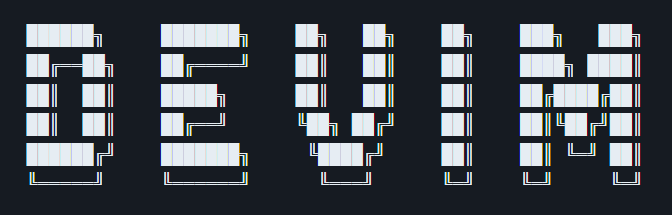

 
    <picture>
      
    </picture>

  
  
  
  

  
  

 
 

## _**Finally, a distro that does what I care about.**_

Hey, I'm Devon — and this is DeVim, my personal dotfiles and tooling setup for Linux, built on top of [Omarchy](https://omarchy.com) by DHH. Minimal diffs, maximum comfort, zero regrets.

Feel free to explore, customize, or shamelessly steal. Suggestions welcome. ❤️

> [!WARNING]\
> This setup is under **active development**. Things may change frequently, and existing config files might get overwritten.
>   This repo only tracks configs that differ from Omarchy's defaults. Install Omarchy first, then layer these on top.
>   _Make sure to back up anything you want to keep._

 
 

## ⚙️ System Overview

[Omarchy](https://omarchy.com) is an opinionated Arch-based distro built by the infamouse DHH. After distro hopping around a bit - some distros trying too hard to be Windows, some cosplaying macOS, most either undercooked or riced in all the wrong ways - this one just fits. It's riced roughly how I would have done it myself, which either says a lot about DHH's taste or raises some questions about where he got his inspiration.

My setup barely differs from the defaults — a few keybindings, a custom Waybar module or two, and the usual NeoVim and tmux that are too deeply in my muscle memory to ever change. That's genuinely it.

#### 🐧 Omarchy. It uses Arch, btw.
- **[Arch Linux](https://archlinux.org/)** — rolling release, AUR access, and a wiki that answers everything.
- **[Hyprland](https://hyprland.org/)** — tiling Wayland compositor. Snappy, GPU-accelerated, and genuinely fun once you stop fighting it.
- **[Waybar](https://github.com/Alexays/Waybar)** — status bar with custom modules, including a live temperature monitor with color-coded alerts for CPU, GPU, and NVMe drives.

####  ✔ Prerequisites
Normally I'd list out package managers, runtimes, fonts, and a handful of other things you need to hunt down yourself. Not here — Omarchy is opinionated and ships with all of that. So the list is short:
- **[Omarchy](https://omarchy.com)** — installed and booted. Follow their guide, come back here when you're staring at your desktop.
- **[A free SSD](https://wiki.archlinux.org/title/Installation_guide)** — or partition an existing drive if you know what you're doing. Either way, that's between you and the internet.
- **[A healthy fear of GUIs](https://www.freecodecamp.org/news/command-line-for-beginners/)** — this setup assumes you're comfortable in the terminal and can Vim your way out of trouble.

 
 

## 📝 Developer Tools Collection

A curated list of tools I use daily for a fast, keyboard-driven development workflow on Linux. These either come with Omarchy or are installed on top.

#### General Tools:
- **[Obsidian](https://obsidian.md/)**: Markdown-based, local-first, Vim-friendly note-taking. Cross-platform so your vault follows you everywhere.
- **[LocalSend](https://localsend.org/)**: Cross-platform AirDrop alternative. Useful across Linux/Mac/Windows.
- **[KeePassXC](https://keepassxc.org/)**: Local password manager. No cloud, no subscription, no drama.
- **[Todoist](https://todoist.com/)**: A clean, cross-platform to-do app for personal tasks, dev stuff, and whatever chaos I’m pretending to control.
> *Linux doesn't need much help in the productivity department. The terminal IS the productivity layer.*

#### Terminal:
- **[Alacritty](https://Alacritty.org/)**: Omarchy's default terminal. Lightweight, fast. No config needed.
- **[Ghostty](https://ghostty.org/)**: Linux backup — cross-platform, written in Zig, native feel on every OS.
> *Omarchy has some opinionated terminals, normally I use wezterm, but DHH and Alacritty is fine.*

#### Shell & Prompt:
- **[Bash](https://www.gnu.org/software/bash/)**: Omarchy default. I stay close to the base config and only add what's necessary.
- **[Starship](https://starship.rs/)**: Fast, portable, Rust-powered. One config across every machine and shell I care about.
> *Normally prefer zsh but trying to stick close to DHH and his opinon that zsh was a mistake.*

#### Editors:
- **[Neovim](https://neovim.io/)**: My main editor — blazingly fast, keyboard-first, fully configured in Lua.
- **[VSCode](https://code.visualstudio.com/)**: The reliable fallback. Decent Vim support when you need a GUI.
> *Use what works, configure what doesn't, and end up falling back to vscode.*

#### Terminal Multiplexing with tmux:
- **[`tmux`](https://en.wikipedia.org/wiki/Tmux)**: Split panes, persistent sessions, parallel processes. Same config as macOS — muscle memory is worth protecting.
> *Hyprland does window tiling at the OS level. tmux does it inside the terminal.*

 
 
 

#### 🧰 CLI Tools

Installed via `yay`, mostly shipped with omarchy.

- **[`lazygit`](https://github.com/jesseduffield/lazygit)** — TUI Git client. Staging, branching, rebasing without leaving the terminal. (Go gang)
- **[`lazydocker`](https://github.com/jesseduffield/lazydocker)** — Same energy, but for Docker. (Go gang)
- **[`k9s`](https://k9scli.io/)** — TUI for Kubernetes. Like lazydocker but for clusters. (Go gang)
- **[`gh`](https://cli.github.com/)** — GitHub from the terminal. PRs, issues, workflows.
- **[`mise`](https://mise.jdx.dev/)** — Runtime version manager. Node, Python, Ruby — one tool, XDG-compliant.
- **[`jq`](https://jqlang.github.io/jq/)** — JSON processor. Essential for any API or DevOps work.
- **[`docker`](https://docker.com)** + **[`docker-compose`](https://docs.docker.com/compose/)** — containers. lazydocker makes it bearable.
- **[`tobi-try`](https://github.com/tobi/try)** — dated scratch directories for experiments. git worktrees under the hood.
- **[`claude-code`](https://claude.ai/code)** — Claude in the terminal. Agentic coding, file editing, codebase questions.
- **[`opencode`](https://opencode.ai/)** — AI coding assistant. Model-agnostic, terminal-native.
- **[`eza`](https://github.com/eza-community/eza)** — Modern `ls` with icons, color, and git status. (Rust gang)
- **[`bat`](https://github.com/sharkdp/bat)** — `cat` with syntax highlighting. Tokyo Night themed.
- **[`fzf`](https://github.com/junegunn/fzf)** — Fuzzy finder for everything. Files, history, git. (Go gang)
- **[`zoxide`](https://github.com/ajeetdsouza/zoxide)** — Smarter `cd`. Learns where you actually go. (Rust gang)
- **[`ripgrep`](https://github.com/BurntSushi/ripgrep)** — Fast `grep`. NeoVim depends on it. (Rust gang)
- **[`fd`](https://github.com/sharkdp/fd)** — Better `find`. Sane syntax, faster results.
- **[`dust`](https://github.com/bootandy/dust)** — Visual `du`. See what's eating your disk at a glance.
- **[`tldr`](https://tldr.sh/)** — Man pages for humans. Real examples, no fluff.
- **[`gum`](https://github.com/charmbracelet/gum)** — Makes shell scripts look beautiful. 
- **[`wl-clipboard`](https://github.com/bugaevc/wl-clipboard)** — Wayland clipboard from the terminal (`wl-copy`, `wl-paste`).
- **[`playerctl`](https://github.com/altdesktop/playerctl)** — Control media players from keybinds or terminal.
- **[`btop`](https://github.com/aristocrathic/btop)** — System monitor that doesn't look like 1995.
- **[`nvtop`](https://github.com/Syllo/nvtop)** — GPU equivalent of btop. NVIDIA/AMD process monitor.
- **[`bluetui`](https://github.com/pythops/bluetui)** — Bluetooth manager TUI. No need to leave the terminal to pair headphones.
- **[`impala`](https://github.com/pythops/impala)** — WiFi manager TUI. Same energy. 
- **[`grim`](https://sr.ht/~emersion/grim/)** + **[`slurp`](https://github.com/emersion/slurp)** — screenshot capture. grim grabs, slurp selects the region.
- **[`satty`](https://github.com/gabm/satty)** — Screenshot annotation. Draw on screenshots before sharing.
- **[`gpu-screen-recorder`](https://git.dec05eba.com/gpu-screen-recorder)** — low overhead screen recording, GPU accelerated.

 

#### 📁 What's Not In This Repo
This repo only tracks configs that differ from Omarchy's defaults. The following are installed and configured on the machine but intentionally not tracked here:

- `walker/` — app launcher
- `swayosd/` — volume/brightness OSD
- `voxtype/` — voice to text
- `wiremix/`, `wireplumber/` — audio routing
- `gtk-3.0/`, `gtk-4.0/` — theming
- `fontconfig/` — font rendering
- `elephant/` — Omarchy note/reminder tool
- `fastfetch/` — system info display (Omarchy themed)
- `foot/` — Omarchy default terminal, no custom config
- `kitty/` — came with Omarchy, unused
- `spotify/` — no config worth tracking
- `libreoffice/` — default config
- `thunderbird/` — email data lives in `~/.thunderbird/`
- `obs-studio/` — scene configs are machine-specific
- `kdenlive/` — project files not config
- `pinta/` — image editor, no meaningful config
- `chromium/` — browser profile (~400MB, cookies, sessions)
- `obsidian/` — vault config contains local machine paths
- `github-copilot/` — auth tokens
- `dconf/`, `fcitx5/`, `pulse/` — system managed
- `nextjs-nodejs/` — Next.js telemetry (`NEXT_TELEMETRY_DISABLED=1`)
