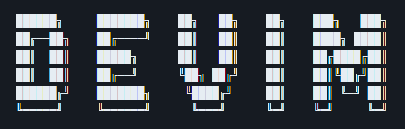

 
 
    <picture>
      
    </picture>

  
  
  
  

  
  

 
 

## _**A minimal Mac setup for full-stack development.**_

Hi, I’m Devon — and this is DeVim, my personal, curated dotfiles setup for macOS. It’s the toolkit I use daily for full-stack development, optimized around the terminal and powered by NeoVim.

Feel free to explore, customize, or shamelessly steal. Suggestions welcome. ❤️

> [!WARNING]\
> This setup is under **active development**. Things may change frequently, and existing config files might get overwritten.  
>   _Make sure to back up anything you want to keep._  

 
 

## ⚙️ System Overview

macOS is a solid base for dev work — Unix roots, slick UI, and fewer headaches than most Linux setups. But it’s far from perfect. The stock terminal? Meh. Window management? Nonexistent. And the productivity layer is barely there. This setup fills in the blanks with tools that actually keep up. (without going fully linux)

#### Because macOS Still Needs a Bit of Help

These tools fix the friction points, smarter multitasking, better window management, faster navigation and less time wasted:

- **[Raycast](https://www.raycast.com/)**: Like Spotlight, but actually good. App launcher, script runner, and productivity Swiss Army knife.
- **[Rectangle](https://rectangleapp.com/)**: Snap windows like it’s Windows. One of the first things I install on any Mac.
- **[AltTab](https://alt-tab-macos.netlify.app/)**: Cmd+Tab the way it was meant to be — with full previews and sanity restored.

> macOS does 80% of the job with style. This setup’s for the last 20% that actually matters.
>   *It’s clean, it’s quiet, it mostly Just Works™* 🙌

 
 

## ✔ Prerequisites

Before diving in, make sure you’ve got these installed — or at least know what they’re for:

- **[Homebrew](https://brew.sh/)** – The package manager. You’ll use it for almost everything.
- **[Node.js](https://nodejs.org/)** – `nvm` recommended. Don't fight the versions manually.
- **[C compiler](https://clang.llvm.org/)** – Comes bundled with Xcode CLI tools.
- **[Lua](https://www.lua.org/)** – Needed for Neovim config, but not as scary as it sounds.
- **[GitHub CLI](https://cli.github.com/)** – Makes GitHub feel local. Essential for Copilot CLI too.
- **[Nerd Fonts](https://www.nerdfonts.com/)** – Hack Nerd and Fira Code Nerd are both great choices.
- **[A healthy fear of GUIs](https://www.freecodecamp.org/news/command-line-for-beginners/)** – this setup assumes you're comfortable in the terminal and can Vim your way out of trouble.

 
 

## 📝Developer Tools Collection

A curated list of tools I use daily to support a fast, keyboard-driven development workflow on macOS. These fill in the gaps, improve the defaults, and make terminal-first dev life smoother.

#### General Tools:
-   **[Raycast](https://www.raycast.com/)**: The macOS launcher Apple wishes it built. Run scripts, manage extensions, control your system — all from your keyboard.
-   **[Obsidian](https://github.com/obsidianmd)**: Markdown-based, local-first, Vim-friendly, cross-platform note-taking app, Excalidraw plugin is cool too.
-   **[Todoist](https://todoist.com/)**: A clean, cross-platform to-do app for personal tasks, dev stuff, and whatever chaos I’m pretending to control.
> *macOS is a solid base for development, but there are still areas where the default experience falls short.*
 

#### Terminal:
- **[WezTerm](https://wezfurlong.org/wezterm/index.html)**: GPU-accelerated, cross-platform, Lua-configurable, and powered by Rust — my daily driver.
- **[iTerm2](https://iterm2.com/)**: Polished and mac-native. Still a strong contender.
> *For fonts, I use [Nerd Fonts](https://www.nerdfonts.com/), usually Hack Nerd or JetBrains Mono. Because vibes matter.*
 

#### Shell:
- **[Zsh](https://www.zsh.org/)** + **[Oh My Zsh](https://ohmyz.sh/)**: Fast, scriptable, and gets out of the way. With just enough plugins to feel modern.
> *Don't skip the extras — autosuggestions and syntax highlighting go a long way.*
 

#### Prompt:
- **[Powerlevel10k](https://github.com/romkatv/powerlevel10k)**: Flashy, customizable, and great if you want everything *just so*.
> *Phasing it out in favor of [Starship](https://starship.rs/) – for lighter, cross-shell setup*
 

#### Editors
Over the years, I’ve used everything from Notepad and Sublime to the cursed Xcode.
- **[VSCode](https://code.visualstudio.com/)**: The GOAT fallback — fast to spin up, decent Vim support, and reliable across platforms.
- **[Neovim](https://neovim.io/)**: My main job, I mean editor — blazingly fast, keyboard-first, and fully configurable with [Lua](https://www.lua.org/).
- **[Cursor](https://cursor.sh/)**: The experimental one — AI-heavy, Copilot-native, and weirdly useful when vibe matters more than precision.
> *Use what works, configure what doesn't, and pretend the defaults were fine all along.*
 

#### Terminal Multiplexing with tmux
**[`tmux`](https://en.wikipedia.org/wiki/Tmux)**: A terminal multiplexer for splitting panes, running parallel processes, and keeping sessions alive — even after closing the terminal.
> *WezTerm’s pane support is tempting, but tmux has the ecosystem, the shortcuts, and years of muscle memory behind it.*

 
 

#### 🧰 Other CLI Tools
These tools are now part of the core experience (via Homebrew in WSL):
- **[`zoxide`](https://github.com/ajeetdsouza/zoxide)** – Modern `cd`. Learns your most used dirs, jump to them faster with fuzzy matches.  (Rust gang)  
- **[`eza`](https://github.com/eza-community/eza)** – Modern `ls`, the rewrite of deprecated exa with built-in color, icons, and better defaults.   (Rust gang)  
- **[`fzf`](https://github.com/junegunn/fzf)** – Fuzzy search for files, history, Git, you name it. Type less, find more it’ll guess what you meant.  (Go gang)
- **[`bat`](https://github.com/sharkdp/bat)** – Drop-in replacement for `cat` with syntax highlighting, line numbers, and paging support. Tokyo themed.
- **[`ripgrep`](https://github.com/BurntSushi/ripgrep)** – Blazing fast `grep` alternative. Used by modern editors. (Rust gang) 
- **[`fd`](https://github.com/sharkdp/fd)** – A simpler, faster alternative to `find`. Better syntax, better defaults, less pain.  
- **[`lazygit`](https://github.com/jesseduffield/lazygit)** – TUI Git client that simplifies staging, branching, rebasing, and reviewing commits.(Go gang) 
- **[`tldr`](https://tldr.sh/)** – Simplified, community-driven man pages, with real-world examples and no fluff.
- **[`nvm`](https://github.com/nvm-sh/nvm)** – Node version manager. Staple tool, cross-platform and reliable.
- **[`thefuck`](https://github.com/nvbn/thefuck)** – Messed up a command? It’ll suggest the right one. Surprisingly useful, endlessly satisfying. (Python gang)
- **[`GitHub Copilot CLI`](https://github.com/github/cli-copilot)** – AI for your terminal, generate commands, explain errors and pretend you did it yourself. 
- **[`zsh-autosuggestions`](https://github.com/zsh-users/zsh-autosuggestions)** – Suggests commands from your history as you type.
- **[`zsh-syntax-highlighting`](https://github.com/zsh-users/zsh-syntax-highlighting)** – Adds real-time syntax highlighting to your Zsh input. 

 
 

---
