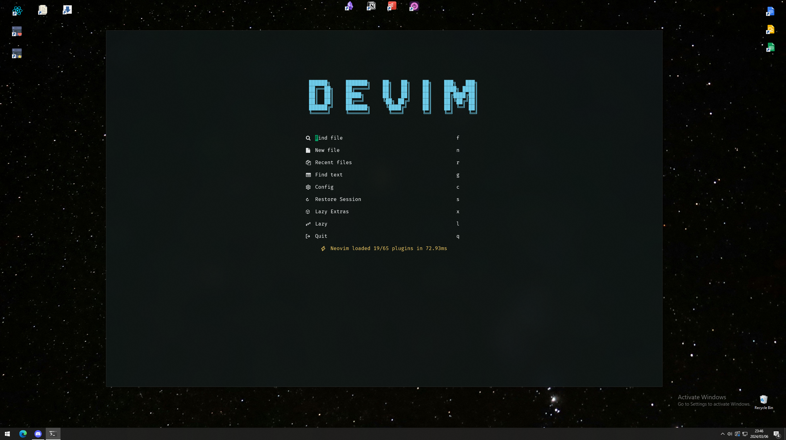

 
 
    <picture>
      
    </picture>

  
  
  
  

  
  

 
 

## _**A minimal Mac setup for full-stack development.**_

Hi, I’m Devon - and this is DeVim, my personal, curated dotfiles setup for macOS. It’s the toolkit I use daily for full-stack development, optimized around the terminal and powered by NeoVim.
Feel free to explore, customize, or shamelessly steal. Suggestions welcome. ❤️

 

 
    <picture>
      
    </picture>

 

## ⚙️ System Overview

MacOS is a solid machine for dev work. Unix roots, Apple silicone, pretty UI and generally fewer headaches than Windows. But let's not pretend it's perfect. 
The stock terminal? Meh. Window management? Barely there. Tiling? Bring your own. Xcode? No thanks.  This setup fills in the blanks with tools that actually keep up.

#### 🍎 Native MacOS Essentials

Because macOS still needs a bit of help.  Not required, but strongly recommended - these fix the friction points and make the whole thing feel like it was designed for developers:

- **[Raycast](https://www.raycast.com/)** - like Spotlight, but actually good. App launcher, script runner, and productivity Swiss Army knife.
- **[Rectangle](https://rectangleapp.com/)** - snap windows around properly. One of the first things I install.
- **[AltTab](https://alt-tab-macos.netlify.app/)** - Cmd+Tab the way it was meant to be, with full previews and sanity.

#### ✔ Prerequisites

[Homebrew](https://brew.sh/) is the only real prerequisite, everything else flows from there. A Nerd Font helps ([Hack](https://www.nerdfonts.com/) or [JetBrains Mono](https://www.nerdfonts.com/) are solid choices) but honestly just `brew install` your way through the rest.  Oh, and a healthy fear of GUIs is recommended. This setup assumes you're comfortable in the terminal and can Vim your way out of trouble.

> macOS does 80% of the job with style. This setup’s for the last 20% that actually matters.
>   *It’s clean, it’s quiet, it mostly Just Works™* 🙌

 
 

## 📝Developer Tools Collection

A curated list of tools I use daily to support a fast, keyboard-driven terminal-first development workflow on macOS. These fill in the gaps, improve the defaults, 
Dont forget the 'Native MacOS Essentails' mentioned above.

#### General Tools:
- **[Obsidian](https://obsidian.md/)**: Markdown-based, local-first note-taking app. Vim-friendly & cross-platform.
- **[LocalSend](https://localsend.org/)**: Open-source AirDrop alternative. Cross-platform across Linux, macOS, Windows, Android, and iOS.
- **[KeePassXC](https://keepassxc.org/)**: Open-source password manager. No cloud, no subscription, no drama.
- **[Todoist](https://todoist.com/)**: Cross-platform to-do app, for pretending to control chaos.

#### Terminal:
- **[WezTerm](https://wezfurlong.org/wezterm/index.html)**: My main terminal. GPU-accelerated, cross-platform, Rust-powered, and Lua-configurable.
- **[iTerm2](https://iterm2.com/)**: Polished and mac-native fallback terminal. Still a strong terminal.

#### Shell + Prompt:
- **[Zsh](https://www.zsh.org/)** + **[Oh My Zsh](https://ohmyz.sh/)**: Fast, scriptable, and gets out of the way. With just enough plugins to feel modern.
- **[Starship](https://starship.rs/)**: Fast, portable, Rust-powered cross-shell prompt. 

#### Editors
- **[Neovim](https://neovim.io/)**: My main job, I mean editor. Blazingly fast, keyboard-first and fully configurable with Lua.
- **[VSCode](https://code.visualstudio.com/)**: The fallback, fast to spin up, decent Vim support and reliable across platforms.

#### Terminal Multiplexing:
- **[`tmux`](https://en.wikipedia.org/wiki/Tmux)**: A terminal multiplexer for splitting panes, running parallel processes, and keeping sessions alive - even after closing the terminal.

#### Other CLI Tools
> 

>   
<em>See list of packages</em>

>
> - **[`zoxide`](https://github.com/ajeetdsouza/zoxide)** - Modern `cd`. Learns your most used directories and lets you jump to them faster with fuzzy matches. Rust gang.
> - **[`eza`](https://github.com/eza-community/eza)** - Modern `ls`. The rewrite of deprecated `exa`, with built-in color, icons, and better defaults. Rust gang.
> - **[`fzf`](https://github.com/junegunn/fzf)** - Fuzzy search for files, history, Git, and basically everything else. Type less, find more. Go gang.
> - **[`bat`](https://github.com/sharkdp/bat)** - Drop-in replacement for `cat` with syntax highlighting, line numbers, and paging support. Tokyo themed.
> - **[`ripgrep`](https://github.com/BurntSushi/ripgrep)** - Blazing fast `grep` alternative. Used by modern editors. Rust gang.
> - **[`fd`](https://github.com/sharkdp/fd)** - A simpler, faster alternative to `find`. Better syntax, better defaults, less pain.
> - **[`lazygit`](https://github.com/jesseduffield/lazygit)** - TUI Git client that simplifies staging, branching, rebasing, and reviewing commits. Go gang.
> - **[`tldr`](https://tldr.sh/)** - Simplified, community-driven man pages with real-world examples and no fluff.
> - **[`nvm`](https://github.com/nvm-sh/nvm)** - Node version manager. Staple tool, cross-platform and reliable.
> - **[`thefuck`](https://github.com/nvbn/thefuck)** - Messed up a command? It suggests the right one. Surprisingly useful, endlessly satisfying. Python gang.
> - **[`GitHub Copilot CLI`](https://github.com/github/gh-copilot)** - AI for your terminal. Generate commands, explain errors, and pretend you did it yourself.
> - **[`zsh-autosuggestions`](https://github.com/zsh-users/zsh-autosuggestions)** - Suggests commands from your history as you type.
> - **[`zsh-syntax-highlighting`](https://github.com/zsh-users/zsh-syntax-highlighting)** - Adds real-time syntax highlighting to your Zsh input.
>
> 

 
 

> [!IMPORTANT]
> #### 📁 What's Not In This Repo
>
> macOS also creates a mountain of app state, GUI preferences, caches, tokens, and “why is this 900MB?” folders. That stuff lives on the machine, not in git. If you’re copying this setup and something looks different, it’s probably one of these:
>
> 

>   
<strong><em>See more?</em></strong>

>
> - Raycast / Alfred / Rectangle / Karabiner — personal workflow tools, not core dotfiles
> - VS Code / Cursor profiles — extensions/settings may be documented, but full app state is not tracked
> - macOS System Settings — some defaults can be scripted, but I’m not pretending macOS GUI state belongs in git
> - Browser profiles — cookies, sessions, extensions, history; no thanks
> - `~/.ssh/`, `~/.gnupg/` — keys and trust state stay private
> - `~/.docker/`, `~/.kube/` — local contexts, auth, machine-specific config
> - `~/.aws/`, `~/.config/gcloud/`, `~/.azure/` — cloud credentials and profiles
> - `~/.npmrc`, `~/.yarnrc.yml` — package-manager auth/local settings
> - `/Applications/`, `~/Applications/` — apps come from Homebrew/Brewfile or manual install
> - `~/Library/Application Support/` — app state, caches, auth, local settings; not portable
> - `~/Library/Preferences/` — noisy macOS/app `.plist` files
> - `~/Library/Keychains/` — passwords, certificates, secrets; absolutely not tracked
> - `~/Library/Fonts/` — fonts are installed separately; grab a Nerd Font if icons look broken
>
> 

---

 
 
