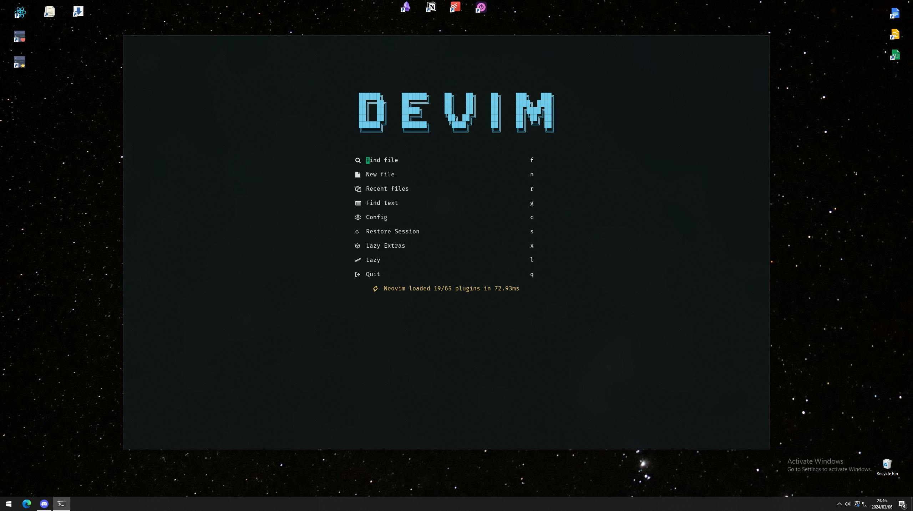

 
 
    <picture>
      
    </picture>

  
  
  
  

  
  

 

## _**Hi my name is Devon and this is DeVim.**_

DeVim is my personal dotfiles and tooling setup for full-stack development. It helps me keep a consistent, fast-to-setup environment across both macOS and Windows (via WSL).

Feel free to explore, tweak, or shamelessly steal — most of it was stolen to begin with. Suggestions welcome. ❤️

> [!WARNING]\
> This setup is under **active development**. Things may change frequently, and existing config files might get overwritten.  
> _Make sure to back up anything you want to keep._  

 
 
    <picture>
      
    </picture>

 

## 🛠️ Setup and Learning Resources

> ⚠️ **The bad news:**  
> This repo doesn’t come with an installer, wizard, or training montage.  
> It also won’t teach you how to Vim or tweak Lua. 

 

> ✅ **The good news:**  
> If you know your way around a terminal, setup is chill.  
> I’ve dropped a lil markdown with my keybindings in the docs — should help you get started.

 
 

## 🙌 Special Thanks

A huge thank you to the following individuals for their support:

-   [@maxischmaxi](https://github.com/maxischmaxi)
-   [@jayson-lennon](https://github.com/jayson-lennon)
-   [@scottmckendry](https://github.com/scottmckendry)
-   [@JazzyGrim](https://github.com/JazzyGrim) (Sindo)
-   [@devaslife](https://www.devas.life/)
-   [@tjdevries](https://github.com/tjdevries)
-   [@ThePrimeagen](https://github.com/theprimeagen)

---
