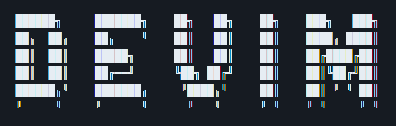
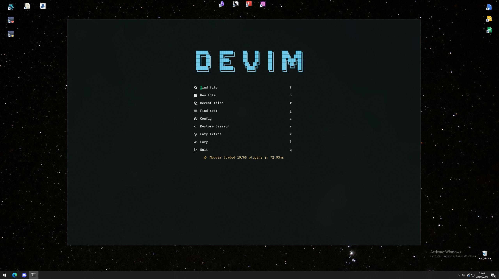

 
 
    <picture>
      
    </picture>

  
  
  
  

## _**Who says you can't vim and look good on Windows?**_
Hi my name is Devon and this is DeVim, my personal curated collection of Windows tools I use for everyday full-stack development. This collection integrates NeoVim seamlessly into Windows, consolidating scattered config files into one convenient location.

Feel free to explore and customize these tools to enhance your development experience! Your suggestions for improvements are always welcome! ❤

> [!NOTE]\
> This repository is **not intended** to be cloned and run as-is.
> It consists of my personal configuration files, which you'll need to set up and configure according to your preferences.

 
 
    <picture>
      
    </picture>

> [!WARNING]\
> Under _**active development**_, expect changes. Existing configuration files will be overwritten. Please make a backup of any files you wish to keep before proceeding.

 

## 📝Developer Tools Collection

A curated list of tools that I use on a daily basis for my development workflow. Below are the main tools included:

#### General Tools:

- [Flow Launcher](https://github.com/Flow-Launcher/Flow.Launcher): An application launcher for Window, quickly open files, folders and apps - think poor mans spotlight/raycast.
- [PowerToys](https://github.com/microsoft/PowerToys): A set of utilities for power users to improve productivity and efficiency on Windows.
- [Obsidian](https://github.com/obsidianmd): A lightweight note taking app that plays well with vim.

#### Terminal:

- [Windows Terminal](https://github.com/microsoft/terminal): A modern, feature-rich terminal application for Windows - think poor mans Tmux.
- [PowerShell7](https://github.com/PowerShell/PowerShell): Decent all purpose terminal with cross-platform environments - think poor mans iTerm2.
- [Chocolatey](https://chocolatey.org/): Modern package manager - think Sudo for Windows.
- [Starship](https://github.com/starship/starship): A minimal, fast, and customizable shell prompt for a better CLI experience - think Oh-My-ZSH.
- [Nerd Fonts](https://www.nerdfonts.com/): A collection of fonts designed for programmers.

#### Editors:

- [Lazy Vim](https://github.com/LazyVim/LazyVim): A starting point for NeoVim I branch from for day to day development.
- [VsCode](https://code.visualstudio.com/): My go to pair programming editor, enhanced with a little Vim magic.

 

## ✔Prerequisites:

Ensure you have the following:

- Node.js
- A C-compiler (or Zig, if you're cool)
- Basic Lua understanding
- Proficiency in Vim and CLI

 

## 🛠️ Setup and Learning Resources

**The bad news:**
As mentioned, this repository doesn't offer automated installation procedures or guides for setting up the tools. It's also not a guide to learning Vim or installing NeoVim.

**The good news:**
The setup process is fairly straightforward and can be figured out with minimal effort. Additionally, I've compiled a collection of learning notes and resources to help you get started with learning Vim and installing lazyvim. [Check it out here](https://devon-gifford.notion.site/Vim-NeoVim-LazyVim-VsCode-emulation-ab098b5f8a8c43c6824633d218a2caf6).

 

## 🙌 Special Thanks

A huge thank you to the following individuals for their support:

- @jayson-lennon
- @scottmckendry
- @JazzyGrim (Sindo)
- @devaslife
- @tjdevries
- @ThePrimeagen

---
